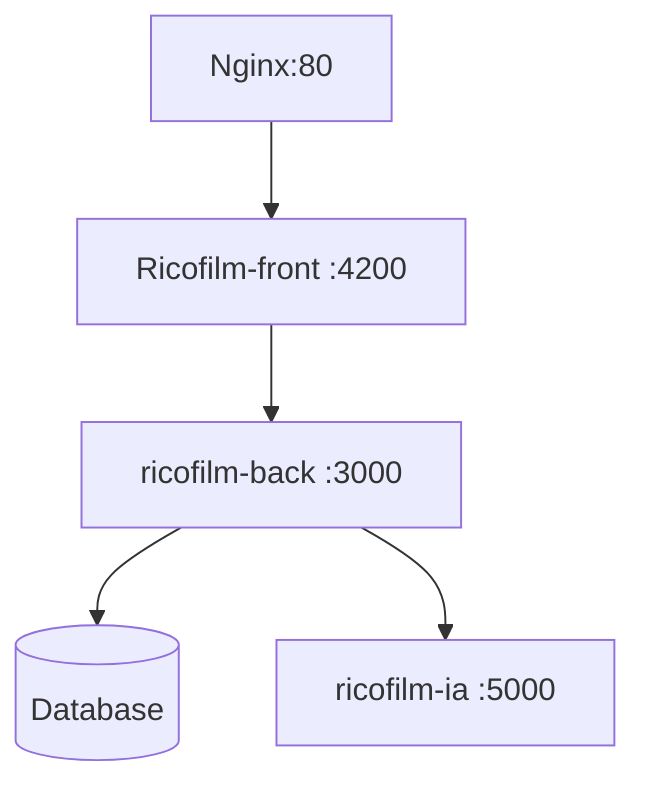

# RicoFilm : Front (Angular) et Back (Node)

## Ricofilm - Architecture


## Dans le linux Ubuntu WSL2


## 1 - Execution de Ricofilm dans le contexte WSL2
Lancer la bd 
docker start mongo-container
Lancer l'application Back
```
#se connecter au container MongoDb 
docker exec -it my_container /bin/bash
#récupérer l’IP de la BD : 
hostname -I | awk '{print $1}'
```
L’indiquer dans : app.js et .env.local ou .env.prod
```
cd /home/eric/ricofilm/docker/ricofilm-web
export MODE_ENV=local ou production
npm start
#Lancer l'application Front
cd /home/eric/ricofilm/docker/AngularRicoFilm
npm start
```

## 2 - Fabrication des docker

```
Arborescence : 
/home/eric/ricofilm/docker
	/AngularRicoFilm/ ←–Front
		Dockerfile		
	/bd/
	/ricofilm-web/ ←–Back-End
		Dockerfile
```

/AngularRicoFilm/Dockerfile : 
``` @dockerfile
# Dockerfile pour le frontend Angular
FROM node:22 AS build
WORKDIR /usr/src/app
COPY package*.json ./
RUN npm install
COPY . .
RUN npm run build --prod

# Étape 2 : Utiliser un serveur léger pour héberger Angular
FROM nginx:alpine
COPY nginx.conf /etc/nginx/conf.d/default.conf
COPY --from=build /usr/src/app/dist/angular-rico-film /usr/share/nginx/html

EXPOSE 80
CMD ["nginx", "-g", "daemon off;"]
```

/ricofilm-web/Dockerfile : 
``` @dockerfile
# Spécifie l'image de base
FROM node:latest
# Définit le répertoire de travail
WORKDIR /app
# Copie les fichiers de l'application
COPY package*.json ./
COPY app.js ./
# Installe les dépendances
RUN npm install
#  Copie les sources dependante
COPY . .
# Expose le port
EXPOSE 3000
# Démarrer l'application
CMD ["npm", "start"]
```

Configuration d'un proxy-pass depuis le NGINX Angular afin d'eviter les problem COORS, NGINX.CONF : 
```
server {
    listen 80;
    server_name localhost;
    
    location / {
        root /usr/share/nginx/html;
        index index.html;
        try_files $uri $uri/ /index.html;
    }
location /films/list {
        proxy_pass http://ricofilm-web-container:3000/films/list;
        proxy_set_header Host $host;
        proxy_set_header X-Real-IP $remote_addr;
        proxy_set_header X-Forwarded-For $proxy_add_x_forwarded_for;
        proxy_set_header X-Forwarded-Proto $scheme;
        add_header 'Access-Control-Allow-Origin' '*';
        add_header 'Access-Control-Allow-Methods' 'GET, POST, OPTIONS';
        add_header 'Access-Control-Allow-Headers' 'Origin, Content-Type, Accept, Authorization';    
    }
    location /films/listmenufilmimage {
        proxy_pass http://ricofilm-web-container:3000/films/listmenufilmimage;
        proxy_set_header Host $host;
        proxy_set_header X-Real-IP $remote_addr;
        proxy_set_header X-Forwarded-For $proxy_add_x_forwarded_for;
        proxy_set_header X-Forwarded-Proto $scheme;
        add_header 'Access-Control-Allow-Origin' '*';
        add_header 'Access-Control-Allow-Methods' 'GET, POST, OPTIONS';
        add_header 'Access-Control-Allow-Headers' 'Origin, Content-Type, Accept, Authorization';
    }
...
```


Création de l’image docker Back : `docker build -t ricofilm-back .`

Création de l’image docker Front : `docker build -t ricofilm-front .`

Création de l'image service IA  : `docker build -t ricofilm-ia .`

Possibilité de choisir le mode d'execution
`export NODE_ENV=production ou local`

Création du container  IA : 
`docker run -d --name ricofilm-iac -p 5000:5000 --env-file .env ricofilm-ia`

Création du container  Back acec indication du env file : env.local ou env.production
`docker run -d --name ricofilm-backc -p 3000:3000  -env-file .env.local --link ricofilm-iac  ricofilm-back`

Création du container  Front : 
`docker run -d --name ricofilm-frontc -p 4200:80  --link ricofilm-backc ricofilm-front`


