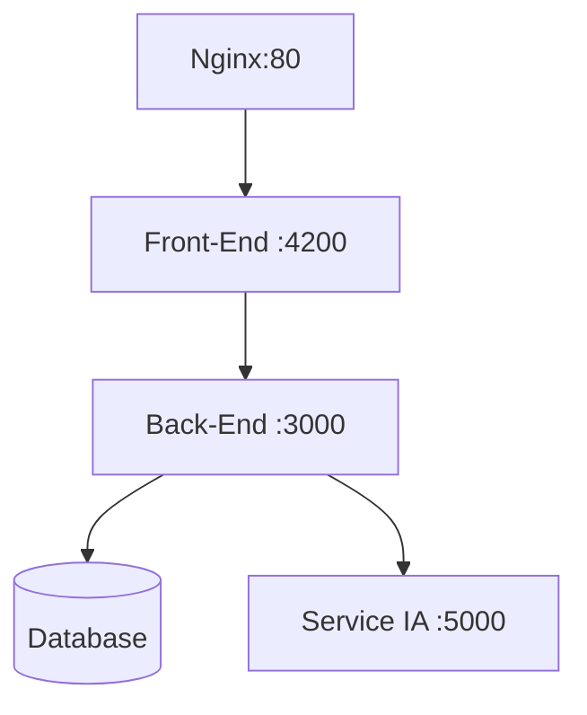

# AngularRicoFilm


## Dans le linux Ubuntu WSL2


## 1 - Execution de Ricofilm dans le contexte WSL2
Lancer la bd 
docker start mongo-container
Lancer l'application Back
se connecter au container MongoDb docker exec -it my_container /bin/bash
récupérer l’IP de la BD : 
```
hostname -I | awk '{print $1}'
```
L’indiquer dans : app.js et db.config.js
```
cd /home/eric/ricofilm/docker/ricofilm-web
npm start
#Lancer l'application Front
cd /home/eric/ricofilm/docker/AngularRicoFilm
npm start
```

## 2 - Fabrication des docker
Arborescence : 
/home/eric/ricofilm/docker
	/AngularRicoFilm/ ←–Front
		Dockerfile		
	/bd/
	/ricofilm-web/ ←–Back-End
		Dockerfile

/AngularRicoFilm/Dockerfile : 
``` @dockerfile
# Dockerfile pour le frontend Angular
FROM node:22 AS build
WORKDIR /usr/src/app
COPY package*.json ./
RUN npm install
COPY . .
RUN npm run build --prod

# Étape 2 : Utiliser un serveur léger pour héberger Angular
FROM nginx:alpine
COPY nginx.conf /etc/nginx/conf.d/default.conf
COPY --from=build /usr/src/app/dist/angular-rico-film /usr/share/nginx/html

EXPOSE 80
CMD ["nginx", "-g", "daemon off;"]
```

/ricofilm-web/Dockerfile : 
``` @dockerfile
# Spécifie l'image de base
FROM node:latest
# Définit le répertoire de travail
WORKDIR /app
# Copie les fichiers de l'application
COPY package*.json ./
COPY app.js ./
# Installe les dépendances
RUN npm install
#  Copie les sources dependante
COPY . .
# Expose le port
EXPOSE 3000
# Démarrer l'application
CMD ["npm", "start"]
```

Création de l’image docker Front :
`docker build -t ricofilm-front`

Création de l’image docker Back : 
`docker build -t ricofilm-back`

Création du container  Back : 
`docker run -d --name ricofilm-back-container -p 3000:3000  ricofilm-back`

Création du container  Front : 
`docker run -d --name ricofilm-front-container -p 4200:80  --link ricofilm-back-container ricofilm-front`


